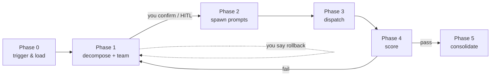

# task-director

> 🎯 A general-purpose "task director" meta-skill: you give the brief, it breaks the task into an Agent team, sets the bar, quality-gates, and distills reusable templates.

<p align="left">
  <a href="README.md">🇨🇳 中文</a> &nbsp;·&nbsp; Issues and PRs welcome
</p>

---

## 💡 Why you'll want it

Does any of this sound familiar?

- You hand an AI a complex task and it either one-lines you or rambles without acting?
- Multi-step work loses context halfway, drifts off course, and you end up cleaning up?
- You want AI to collaborate in parallel but don't know how to split or accept the result?

**task-director handles exactly that.** It is never the doer — it is the **director**: decompose, team up, set acceptance lines, cover edges, log bias, prune. You keep the final call; it carries the dirty work of orchestration and quality-gating.

## ✨ Features

- **🤝 HITL first, auto escape hatch** — shows the team plan for your nod by default; says "just do it / auto" and it runs silent, no interruption to your flow.
- **🧩 Three-layer dispatch** — Director / specialist modules (UI, code quality baselines) / Workers. Taste and rules live in the modules, never hardcoded in the flow.
- **📊 10-point scale, 5 dynamic dimensions** — proposal / execution / deliverable / innovation / compliance; specialists override weights (e.g. UI deliverable → 0.35).
- **🛡️ Score calibration log** — AI grading AI drifts. Every 5 "human-low / machine-high" gaps tighten that dimension's default by 0.3; recovers after 3 consistent runs. Honest over time.
- **🗂️ Template retirement** — retires only on dual condition (>90d unused AND a higher-score peer appears). Low-frequency users never purged by a timer; high-frequency users never dragged by entropy.
- **⚖️ User veto right** — any score can be overturned; "rollback to Phase 1" final call is always yours. Flow serves trust, not the number.

## 🚀 Quick start

**Install** — copy the whole dir into your Agent skills path (keep the name `task-director`):

```text
WorkBuddy:   ~/.workbuddy/skills/task-director/
Claude Code: ~/.claude/skills/task-director/   # or .agents/skills, .anybox/skills
```

The dir must contain: `SKILL.md`, `specialist-registry.md`, `role-templates.md`, `score-calibration-log.md`, `role-templates-archive.md`.

**Use**

- Triggers: `派任务` / `orchestrate` / `导演` / `任务拆分` / `分身协作`
- Trust mode: command contains `直接派` / `just do it` / `auto` → Phase 1 runs silent.
- Red lines (hard stop for you): privacy, public release, irreversible ops, budget.

## 🔄 How it works



1. **Phase 0 trigger & load** — optionally load your user-profile / specialist modules; fall back to generic defaults if absent.
2. **Phase 1 decompose + team design** — task type, complexity, deps, risks, Agent team table. **This is your confirmation point.**
3. **Phase 2 spawn sub-agent prompts** — self-contained, explicit output specs for later scoring.
4. **Phase 3 dispatch** — parallel / pipeline / iterate (≤3 rounds per agent); ≤4 workers +1 integrator.
5. **Phase 4–5 score & consolidate** — 10-pt 5-dim scoring; ≥8 enters the role-template library.

## 🔧 Customize

**Specialist interface** — mount your domain baselines (UI taste, code style, writing) in `specialist-registry.md` by schema; the bundled `ui-design-baseline` is a format demo only — swap in your own.

**User-profile interface** — if you distilled a user-profile / persona module (e.g. `user-profile/self.md`, `persona.md`), optionally read it in Phase 0 to calibrate tone and privacy boundaries. **Fully optional**; runs fine without it.

## 🪞 Meta · it reviewed its own release

This repo's release prep (de-personalize, generalize deps, author credits, write docs) was itself produced and reviewed by **task-director** in HITL mode — the director decomposed the publish task, spawned sub-agent prompts, scored, consolidated, all under your veto. A skill auditing its own release is the closed-loop proof of its creed: orchestrate, not author; quality-gate, never decide for you.

## 📁 Structure

```text
task-director/
├── SKILL.md                  # skill body: 5-Phase flow + 10-pt scorecard
├── specialist-registry.md   # specialist mounts & weight overrides (demo included)
├── role-templates.md         # verified role-template library (2 demos)
├── score-calibration-log.md # human-vs-machine bias log (empty template)
├── role-templates-archive.md# retired template archive (empty template)
├── LICENSE                   # MIT
├── README.md                 # this page (中文)
└── README.en.md              # English version
```

## 📄 License

[MIT](LICENSE) © 2026 小凛酱丷
