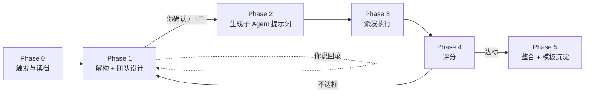

# task-director · 任务总监

> 🎯 一个通用的「任务总监」元技能：你只管下指令，它把任务拆成 Agent 团队、定标准、做质检、把跑通的经验存成可复用模板。

<p align="left">
  <a href="README.en.md">🇬🇧 English</a> &nbsp;·&nbsp; 欢迎提 Issue / PR
</p>

---

## 💡 为什么你需要它

你是不是常遇到这些事：

- 丢给 AI 一个复杂任务，它要么一句话敷衍，要么啰嗦半天不动手？
- 多步骤任务做到一半，上下文丢了、方向偏了，还得你从头收拾？
- 想让 AI 分工协作，但不知道怎么拆、怎么验收？

**task-director 就是来管这些事的。** 它不当执行者，只当**总监**——拆解、组队、定验收线、兜底、记偏差、断舍离。你保留最终决定权，它替你扛下调度与质检的脏活。

## ✨ 核心特性

- **🤝 HITL 优先，auto 可逃逸** — 默认先亮出团队方案等你点头；你说「直接派 / auto」时静默执行，不打断你的节奏。
- **🧩 三层调度** — 总监 / 专精模块（UI、代码等质量基线）/ 子 Agent（Worker）。审美与规范留在专精模块里，不写死在主流程。
- **📊 10 分制 + 5 维动态权重** — 提案 / 执行 / 交付物 / 创新 / 合规；专精模块可覆盖权重（如 UI 类交付物权重升到 0.35）。
- **🛡️ 评分校准日志** — AI 给 AI 打分会漂移。每积累 5 条「人觉得差、机却给了高分」的偏差，该维度默认给分自动收紧 0.3，连续 3 次一致才恢复。越用越诚实。
- **🗂️ 模板退役机制** — 双条件（>90 天未用 **且** 出现更高分同类模板）才退役。低频用户不被定时器误杀，高频用户不被熵增拖垮。
- **⚖️ 用户否决权** — 任何评分你都能推翻，「回滚到 Phase 1」的终审永远在你手里。流程为信任服务，不为分数奴役。

## 🚀 快速开始

**安装** — 把整个目录复制进你的 Agent skills 路径（目录名保持 `task-director`）：

```text
WorkBuddy:   ~/.workbuddy/skills/task-director/
Claude Code: ~/.claude/skills/task-director/   # 或项目内 .agents/skills、.anybox/skills
Codex:       ~/.codex/skills/task-director/    # 或 $CODEX_HOME/skills/task-director/
项目通用:    .agents/skills/task-director/
```

目录内需含：`SKILL.md`、`specialist-registry.md`、`role-templates.md`、`score-calibration-log.md`、`role-templates-archive.md`。

**使用**

- 触发词：`派任务` / `orchestrate` / `导演` / `任务拆分` / `分身协作`
- 信任模式：指令含 `直接派` / `别问直接做` / `auto` 时，Phase 1 静默执行。
- 红线（强制停下等你）：隐私、对外发布、不可逆操作、预算安全。

## 🔄 它是怎么运作的



1. **Phase 0 触发与读档** — 可选读取你的用户画像 / 专精模块；没有就退化为通用默认。
2. **Phase 1 解构 + 团队设计** — 任务类型、复杂度、依赖、风险、Agent 团队表。**这是你拍板的确认点。**
3. **Phase 2 生成子 Agent 提示词** — 自包含、输出规范明确，为后面评分留据。
4. **Phase 3 派发执行** — 并行 / 流水线 / 迭代（单 Agent ≤3 轮）；执行 Agent ≤4，加整合专员 ≤5。
5. **Phase 4–5 评分与沉淀** — 10 分制 5 维打分，综合分 ≥8 入库为角色模板。

## 🔧 自定义

**专精模块接口** — 在 `specialist-registry.md` 按 schema 挂载你的领域基线（UI 审美、代码规范、写作风格…）。内置的 `ui-design-baseline` 只是格式演示，替换成你自己的模块即可。

**用户画像接口** — 如果你蒸馏过自己的用户画像 / 人格偏好（如 `user-profile/self.md`、`persona.md`），可在 Phase 0 声明读取，用于校准表达风格与隐私边界。**完全可选**，不读取也能正常运行。

## 🪞 Meta · 它审核了自己的发布

这个仓库的发布准备（去个人化、依赖泛化、作者署名、写文档）本身，就是由 **task-director** 在 HITL 模式下跑完的——总监解构发布任务、生成子 Agent 提示词、评分、沉淀，全程受你的否决权约束。一个技能审核自己的发布，恰好印证了它的信条：**调度而不产内容，质检而不替你决断。**

## 📁 文件结构

```text
task-director/
├── SKILL.md                  # 技能本体：5 Phase 工作流 + 10 分制评分卡
├── specialist-registry.md   # 专精模块挂载与权重覆盖（含示例占位）
├── role-templates.md         # 已验证角色模板库（含 2 个示例模板）
├── score-calibration-log.md # 人 vs 机 偏差校准日志（空模板，运行时追加）
├── role-templates-archive.md # 退役模板归档库（空模板）
├── LICENSE                   # MIT
├── README.md                 # 本文件（中文）
└── README.en.md              # English version
```

## 📄 协议

[MIT](LICENSE) © 2026 小凛酱丷
